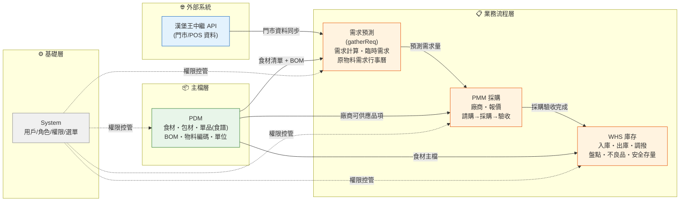
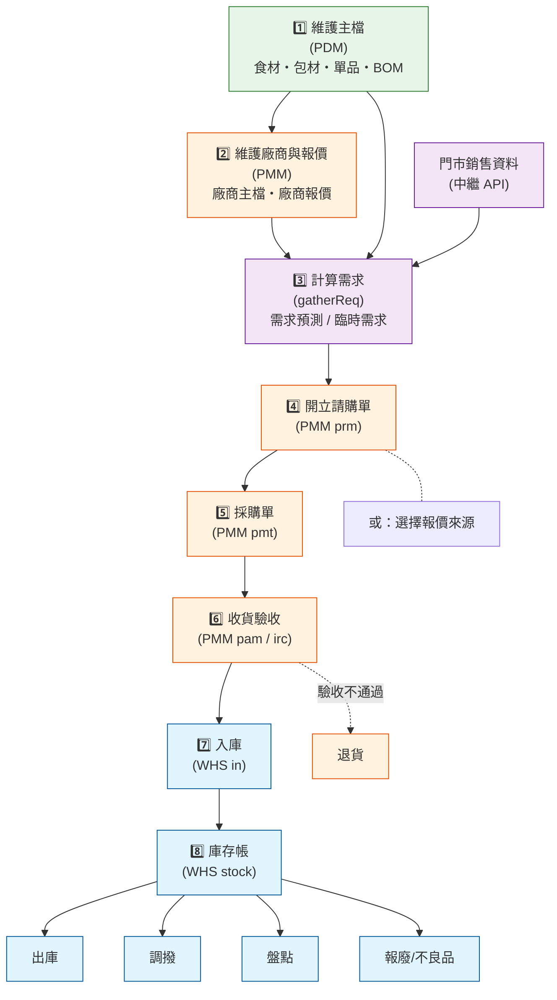
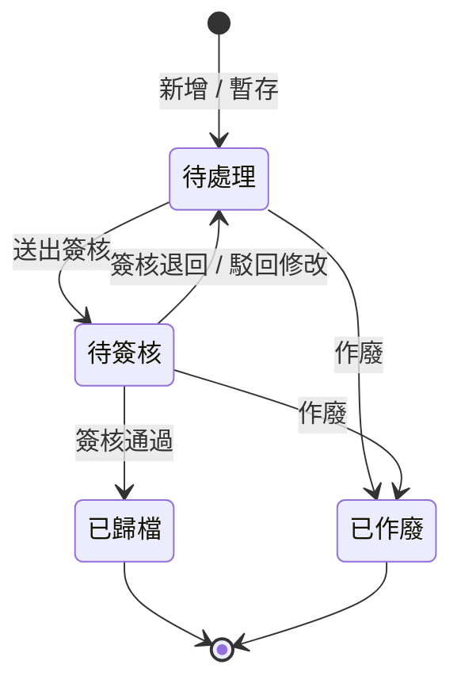
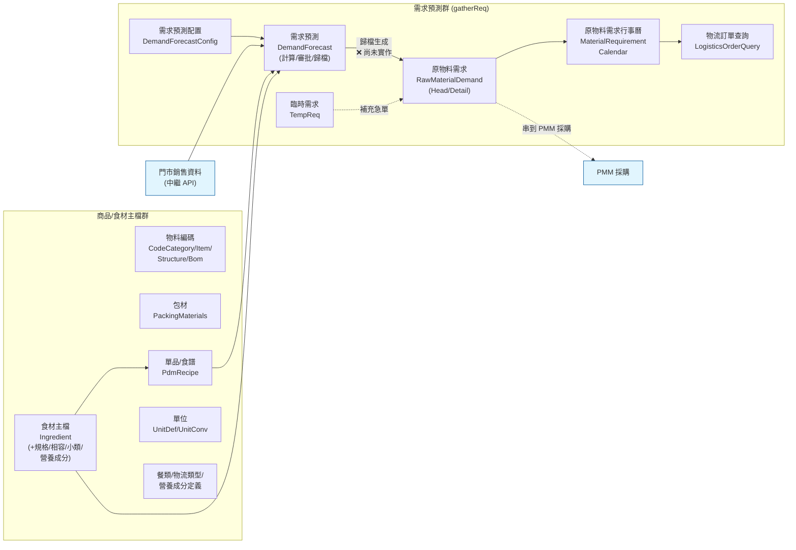
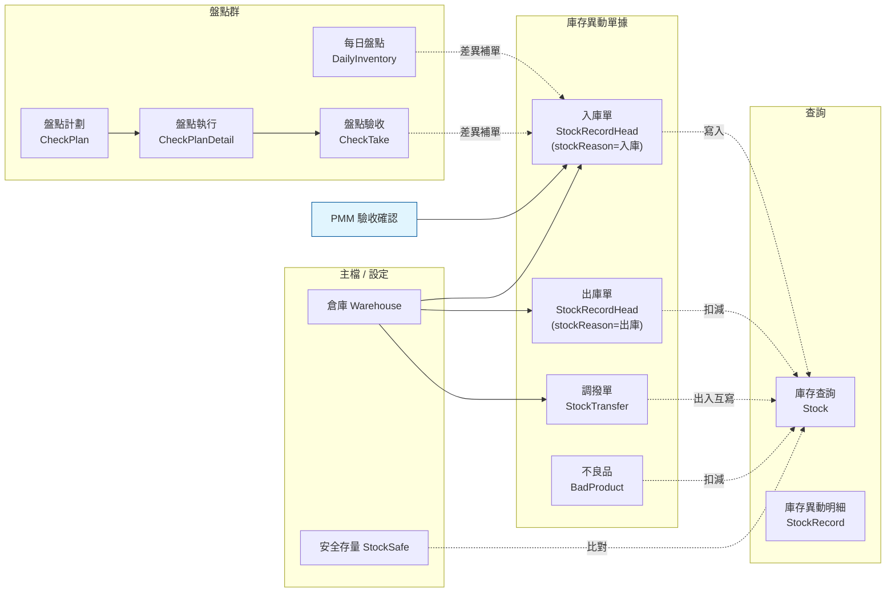
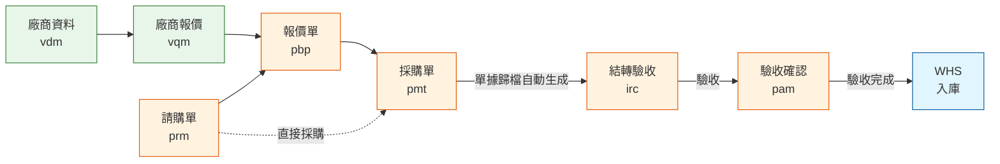
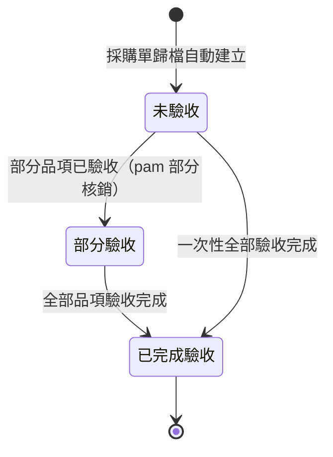

# 漢堡王 ERP 系統功能說明書

> 性質：As-Is 現況盤點（非 PRD）
> 讀者：PM / 產品方為主，工程師可順帶查程式碼位置
> 對應程式碼版本：`erp-spring` 後端 + `erp-kingmaker` 前端
> 最後更新：2026-05-14
> 完成度欄符號（沿用 [`STATUS.md`](./STATUS.md)）：✅ 已完成・🔶 部分完成・❌ 未完成・❓ 未知・🧊 凍結

---

## 文件範圍

本文件涵蓋以下模組：

| 模組 | 後端目錄 | 前端目錄 | 章節 |
|---|---|---|---|
| **PDM** 商品資料 + 需求預測 | `kingmaker-module-pdm` | `views/pdm/` + `views/gatherReq/` | 詳寫（待補） |
| **WHS** 庫存管理 | `kingmaker-module-whs` | `views/stock/` | 詳寫（待補） |
| **PMM** 採購管理 | `kingmaker-module-pmm` | `views/pmm/` | 詳寫（待補） |
| **System** 用戶/角色/權限/選單 | `kingmaker-module-system` | `views/system/` | 簡寫（待補） |

---

## 1. 系統總覽

### 1.1 一句話定位

漢堡王 ERP 是供漢堡王台灣**內部使用**的企業資源規劃系統，從**商品/食材主檔**起，串接**需求預測 → 採購 → 進貨入庫 → 庫存管理**的供應鏈核心流程。

### 1.2 系統全景圖



### 1.3 模組功能地圖

| 模組 | 中文名 | 一句話業務說明 | 子功能數 | 整體狀態 |
|---|---|---|---|---|
| PDM | 商品資料 + 需求預測 | 維護食材/包材/單品(食譜)/BOM/單位等主檔，並計算原物料需求預測 | ~20 | 🔶 主檔完備，需求預測部分完成 |
| WHS | 庫存管理 | 倉庫存量帳務：入庫/出庫/調撥/盤點/不良品/安全存量 | ~12 | 🔶 開發中 |
| PMM | 採購管理 | 從廠商主檔、報價、請購、採購到驗收的完整採購流程 | 7 | 🔶 開發中 |
| System | 系統管理 | 用戶/角色/部門/選單/字典/門店/通知等通用後台 | ~10 | ✅ 完備 |

> 詳細各子功能完成度請見 [`STATUS.md`](./STATUS.md)。

### 1.4 整體採購供應鏈業務流程



---

## 2. 業務模組

### 2.0 業務模組共用單據狀態流轉

PDM / WHS / PMM 三大業務模組所有「會走簽核」的單據（包含食材主檔、廠商主檔、各類採購/庫存單據）都共用同一套狀態機，定義於 [`ProcessStatusEnums.java`](../../../erp-spring/kingmaker-module-pmm/kingmaker-module-pmm-biz/src/main/java/com/newsoft/kingmaker/module/pmm/dal/enums/ProcessStatusEnums.java)：



> 各子功能差異僅在「進入下一階段的觸發點」（例：採購單歸檔自動建立結轉驗收單、需求預測歸檔產生原料需求、驗收確認歸檔觸發入庫）；狀態流本身一致。各子功能段落不再重複此圖，僅標註「依共用狀態機 (2.0)」。

---

### 2.1 PDM — 商品資料 + 需求預測 🔶

> 整體狀態：🔶 主檔大部分完成，**需求預測歸檔後產生原料需求的核心業務邏輯尚未實作（❌）**（依 [`STATUS.md`](./STATUS.md)）

PDM 模組分兩大區塊：**(A) 商品/食材主檔**（食材、包材、單品/食譜、編碼、單位、餐類…）— 是其他業務模組的資料源頭；**(B) 需求預測**（從中繼 API 拉門市銷售資料 → 計算原物料需求 → 歸檔生成採購依據）。後者主流程已可運作但歸檔生成原料需求的環節（`processDemandForecastArchived()`）目前為空 TODO。

#### 2.1.0 PDM 模組業務流程



#### 2.1.A 物料/編碼主檔群 ✅

通用 **編碼三層 + BOM** 機制：CodeCategory（編碼大類）→ CodeItem（編碼項目）→ CodeStructure（編碼結構）→ CodeBom（BOM 配方）。這層是其他業務單據的「分類字典」。

| 子功能 | 狀態 | 後端 Controller | 前端路由 / 元件 |
|---|---|---|---|
| 物料編碼大類 | ✅ | `PdmCodeCategoryController` | `views/pdm/basicSettings/codecategory/index.vue` |
| 物料編碼項目 | ✅ | `CodeItemController` | `views/pdm/basicSettings/codeitem/index.vue` |
| 物料編碼結構 | ✅ | `CodeStructureController` | `views/pdm/basicSettings/codestructure/index.vue` |
| BOM 配方 | ✅ | `CodeBomController` | （前端在數個模組底下有 codebom 引用） |

> 這群是純 CRUD 主檔，無簽核流程；不單獨畫畫面，PM 視角主要為「分類字典維護」。

---

#### 2.1.B 食材主檔（Ingredient）✅

> 📁 後端 `pdm.controller.admin.ingredient.IngredientController` · 前端 `views/pdm/dataSettings/Ingredients/codebom/index.vue`（列表） + `views/pdm/dataSettings/Ingredients/detail/index.vue`（明細） · 路由 `/pdm/dataSettings/ingredients`

**業務說明**：食材主檔。包含食材中類、小類、原型食材、規格、相容性、營養成分等。新增/修改食材需走簽核流程（同共用狀態機）。食材主檔下掛接多個子表：

| 子表 | 狀態 | Controller | 用途 |
|---|---|---|---|
| 食材規格 IngredientSpecs | ✅ | `IngredientSpecsController` | 同一食材的不同規格／包裝 |
| 食材相容性 IngredientCompat | ✅ | `IngredientCompatController` | 食材間替代/共用關係 |
| 食材小類 IngredientSubcategoryType | ✅ | （列於 STATUS.md，最新加入） | 細分類別 |
| 食材營養成分 IngredientNutritionalContents | 🔶 | `IngredientNutritionalContentsController` | 刪除邏輯 TODO |

```
┌─ 食材主檔 ─────────────────────────────────────────────────────────
│  [單據編號] [建立時間] [來源]   [搜尋] [重置]    [+ 新增]
├────────────────────────────────────────────────────────────────────
│  # │ 單據編號 │ 單據日期 │ 食材中類 │ 食材小類 │ 原型食材 │ 狀態   │ 更新時間
│  1 │ I-0001   │ 2026-04  │ 主食類   │ 漢堡肉   │ 牛肉餅   │ 已歸檔 │ 2026-04-12
│  2 │ I-0002   │ 2026-04  │ 飲品類   │ 碳酸     │ 可樂     │ 待簽核 │ 2026-04-13
│  ...
├────────────────────────────────────────────────────────────────────
│  < 1 2 3 ... >                             共 N 筆
└────────────────────────────────────────────────────────────────────
```

**狀態流轉**：依共用狀態機（2.0）。

---

#### 2.1.C 單品 / 食譜（PdmRecipe）🔶

> 📁 後端 `pdm.controller.admin.recipe.PdmRecipeController` · 前端 `views/pdm/dataSettings/Recipe/codebom/index.vue`（列表）+ `views/pdm/dataSettings/Recipe/detail/index.vue`（明細）· 路由 `/pdm/dataSettings/recipe`

**業務說明**：產品（單品/餐點）的食譜定義。記錄一份單品由哪些食材＋幾克組成（透過 BOM）。**注意**：後端類別名稱叫 Recipe（食譜），前端路由顯示「單品」。

**待補 TODO**：營養成分關聯（依 STATUS.md，待食材/食譜子表建立後補上）。

```
┌─ 單品（食譜） ─────────────────────────────────────────────────────
│  [單據編號] [建立時間]   [搜尋] [重置]    [+ 新增]
├────────────────────────────────────────────────────────────────────
│  # │ 單據編號 │ 單據日期 │ 單品名稱 │ 餐類     │ 狀態   │ 更新時間
│  1 │ R-0001   │ 2026-04  │ 華堡套餐 │ 午餐     │ 已歸檔 │ 2026-04-12
│  ...
├────────────────────────────────────────────────────────────────────
│  < 1 2 3 ... >                             共 N 筆
└────────────────────────────────────────────────────────────────────
```

**狀態流轉**：依共用狀態機（2.0）。

---

#### 2.1.D 包材主檔（PackingMaterials）✅

> 📁 後端 `pdm.controller.admin.packingmaterials.PackingMaterialsController` · 前端 `views/pdm/dataSettings/PackagingMaterials/codebom/index.vue`（列表）+ `views/pdm/dataSettings/PackagingMaterials/detail/index.vue`（明細）· 路由 `/pdm/dataSettings/packagingMaterials`

**業務說明**：包材主檔（紙袋、紙杯、餐盒等）。屬性類似食材但更單純，亦走簽核流程。明細子表 `PackingMaterialsDtl` 記錄不同規格/尺寸。

```
┌─ 包材主檔 ─────────────────────────────────────────────────────────
│  [單據編號] [建立時間]   [搜尋] [重置]    [+ 新增]
├────────────────────────────────────────────────────────────────────
│  # │ 單據編號 │ 單據日期 │ 包材名稱 │ 規格      │ 狀態   │ 更新時間
│  1 │ P-0001   │ 2026-04  │ 中杯紙杯 │ 16oz      │ 已歸檔 │ 2026-04-12
│  ...
├────────────────────────────────────────────────────────────────────
│  < 1 2 3 ... >                             共 N 筆
└────────────────────────────────────────────────────────────────────
```

**狀態流轉**：依共用狀態機（2.0）。

---

#### 2.1.E 其他基礎主檔群（無簽核）

| 子功能 | 狀態 | 後端 Controller | 前端 |
|---|---|---|---|
| 餐類管理 MealType | 🔶 | `MealTypeController` | `views/pdm/basicSettings/mealtype/` |
| 營養成分定義 NutritionalDefinitions | 🔶 | `NutritionalDefinitionsController` | `views/pdm/basicSettings/nutritionaldefinitions/` |
| 物流類型 LogisticsType | ✅ | `LogisticsTypeController` | （字典類，常被其他模組引用） |
| 單位定義 PdmUnitDef | ✅ | `PdmUnitDefController` | `views/pdm/basicSettings/unitdefinition/` |
| 單位換算 PdmUnitConv | ✅ | `PdmUnitConvController` | `views/pdm/basicSettings/unitconversion/` |
| 原物料物流 RawMaterialLogistics | ✅ | `RawMaterialLogisticsController` | （字典類） |

> 此群皆為「靜態字典維護」，無業務狀態流，純 CRUD。MealType / NutritionalDefinitions 三個項目的「刪除」邏輯尚有 TODO（依 STATUS.md）— 待食材/食譜子表建立後補上。

---

#### 2.1.F 臨時需求（TempReq）✅

> 📁 後端 `pdm.controller.admin.tempreq.TempReqController` · 前端 `views/gatherReq/TemporaryCalculation/codebom/index.vue`（列表）+ `views/gatherReq/TemporaryCalculation/detail/index.vue`（明細）· 路由 `/gatherReq/temporaryCalculation`

**業務說明**：補充正規需求預測（DemandForecast）之外的「急單需求」。例：促銷活動、突發訂單。可單獨送入後續採購流程。

```
┌─ 臨時需求 ─────────────────────────────────────────────────────────
│  [單據編號] [建立日期]   [搜尋] [重置]    [+ 新增]
├────────────────────────────────────────────────────────────────────
│  # │ 單據編號 │ 單據日期 │ 需求門市 │ 需求週次 │ 狀態   │ 更新時間
│  1 │ T-0001   │ 2026-04  │ 台北 01  │ W18      │ 已歸檔 │ 2026-04-12
│  ...
├────────────────────────────────────────────────────────────────────
│  < 1 2 3 ... >                             共 N 筆
└────────────────────────────────────────────────────────────────────
```

**狀態流轉**：依共用狀態機（2.0）。

---

#### 2.1.G 需求預測（DemandForecast）🔶 ⚠ 核心業務缺口

> 📁 後端 `pdm.controller.admin.demand.DemandForecastController` + `DemandForecastDetailController` + `DemandForecastConfigController` · 前端 `views/gatherReq/ReqCalculation/codebom/index.vue`（列表）+ `views/gatherReq/ReqCalculation/detail/index.vue`（明細）· 路由 `/gatherReq/reqCalculation`

**業務說明**：PDM 模組的核心業務功能。流程為：
1. 配置預測規則（DemandForecastConfig，例如預測模式、調整百分比）
2. 從漢堡王中繼 API 拉取門市銷售資料
3. 系統計算每個食材的需求量
4. 送出簽核
5. **歸檔後應自動生成原料需求單（RawMaterialDemand）** — ⚠ **目前 `processDemandForecastArchived()` 為空 TODO，核心業務邏輯缺失**

```
┌─ 需求預測 ─────────────────────────────────────────────────────────
│  [單據編號] [日期] [預測模式▾] [需求週次] [銷售資料▾]   [搜尋] [+ 新增]
├────────────────────────────────────────────────────────────────────
│  # │ 單據編號 │ 單據日期 │ 預測模式 │ 門市群 │ 需求門市 │ 需求週次 │ 銷售資料  │ 調整% │ 狀態
│  1 │ D-0001   │ 2026-04  │ 月平均   │ 北一區 │ 台北 01  │ W19      │ 2026-W18  │ +10%  │ 待簽核
│  ...
├────────────────────────────────────────────────────────────────────
│  < 1 2 3 ... >                             共 N 筆
└────────────────────────────────────────────────────────────────────
```

**狀態流轉**：依共用狀態機（2.0）。
**特殊副作用**：歸檔時**應該**自動生成 `RawMaterialDemand`（原料需求）— ❌ 目前未實作，需補。
**相關 TODO**：`DemandForecastMapper` — 廠商歸檔條件過濾邏輯被 TODO 標記，需補。

---

#### 2.1.H 原物料需求 / 行事曆 / 物流訂單

| 子功能 | 狀態 | 後端 Controller | 前端 |
|---|---|---|---|
| 原物料需求表頭 RawMaterialDemandHead | ❓ | `RawMaterialDemandHeadController` | （由需求預測歸檔產生 — 串接未實作） |
| 原物料需求明細 RawMaterialDemand | ❓ | `RawMaterialDemandController` | （同上） |
| 需求預測配置 DemandForecastConfig | ✅ | `DemandForecastConfigController` | （配置頁） |
| 原物料需求行事曆 | （非 ✅ 標註）| — | `views/gatherReq/MaterialRequirementCalendar/list/index.vue` |
| 物流訂單查詢 | （非 ✅ 標註）| — | `views/gatherReq/LogisticsOrderQuery/list/index.vue` |

> 原物料需求兩個 Controller 已建立但串接邏輯未實作（依 STATUS.md ❓）；行事曆與物流訂單查詢為視覺化工具，依日期顯示需求總量與物流派送計劃。

---

### 2.2 WHS — 庫存管理 🔶

> 整體狀態：🔶 大部分子功能可運作但有多項 TODO；倉庫名稱（WarehouseName）與庫存異常處理缺失（❌）（依 [`STATUS.md`](./STATUS.md)）

WHS 管理倉庫、庫存帳、出入庫、調撥、盤點、不良品、安全存量。與 PMM 透過「驗收確認 → 入庫」串接（PMM 驗收歸檔會觸發 WHS 寫入庫存異動）。

#### 2.2.0 WHS 模組業務流程



#### 2.2.A 倉庫主檔（Warehouse）🔶

> 📁 後端 `whs.controller.admin.warehouse.WarehouseController` · 前端 `views/stock/stockBasic/`

**業務說明**：倉庫定義（中央倉、門市倉、配送中心等）。純 CRUD，無簽核流程。**TODO**：部分驗證仍用 `IllegalArgumentException` 而非框架 `ServiceExceptionUtil`（依 STATUS.md）。

**注意**：另有 `WarehouseName` DO + Mapper 存在但無 Controller / Service（❌），用途不明，需釐清。

---

#### 2.2.B 庫存查詢（Stock）🔶

> 📁 後端 `whs.controller.admin.stock.StockController` · 前端 `views/stock/storageQuery/`

**業務說明**：即時查詢各倉/各食材的當前庫存量。純查詢功能，無操作。**TODO**：依門市計算庫存的中繼 API 尚未對接（依 STATUS.md）。

---

#### 2.2.C 入庫 / 出庫（StockRecordHead）✅

> 📁 後端 `whs.controller.admin.stockrecordhead.StockRecordHeadController`（表頭）+ `whs.controller.admin.stockrecord.StockRecordController`（明細）· 前端 `views/stock/in/`（入庫）+ `views/stock/out/`（出庫）· 路由 `/stock/in/detail`、`/stock/out/detail`

**業務說明**：庫存異動的核心單據，**入庫與出庫共用同一張表頭結構**，以 `stockReason` 區分業務類別（入庫事由：採購入庫、調撥入庫、盤點補入；出庫事由：銷售出庫、調撥出庫、報廢出庫…）。由 PMM 驗收歸檔自動建立入庫單，或由其他模組觸發出庫。

```
┌─ 入庫單 ───────────────────────────────────────────────────────────
│  [單據編號][單據日期 起~迄][門市區域▾][入庫倉別▾][入庫倉]
│  [入庫日期][入庫事由▾][來源單據]    [搜尋][重置]   [+ 新增]
├────────────────────────────────────────────────────────────────────
│  # │ 單據編號 │ 單據日期 │ 門市區域 │ 入庫倉別 │ 入庫倉名 │ 入庫日期 │ 入庫事由 │ 來源單據 │ 流程狀態
│  1 │ IN-0001  │ 2026-04  │ 北一區   │ 中央倉   │ CWH-01   │ 2026-05  │ 採購入庫 │ AC-0001  │ 已歸檔
│  ...
├────────────────────────────────────────────────────────────────────
│  < 1 2 3 ... >                             共 N 筆
└────────────────────────────────────────────────────────────────────
```

> 出庫單畫面結構相同，差異僅在欄位文字：入庫倉 → 出庫倉、入庫日期 → 出庫日期、入庫事由 → 出庫事由。

**狀態流轉**：依共用狀態機（2.0）。

---

#### 2.2.D 調撥單（StockTransfer）🔶

> 📁 後端 `whs.controller.admin.stocktransfer.StockTransferController`（表頭）+ `StockTransferDetailController`（明細）· 前端 `views/stock/transfer/index.vue`（列表）+ `views/stock/transfer/detail/index.vue`（明細）· 路由 `/stock/transfer/detail`

**業務說明**：倉與倉之間的庫存轉移。一張調撥單同時生成「出庫倉 -X」和「入庫倉 +X」兩筆 StockRecord。簽核後生效。

```
┌─ 調撥單 ───────────────────────────────────────────────────────────
│  [單據編號][單據日期 起~迄][門市區域▾][出庫倉名][入庫倉名]
│  [調撥日期][主旨][物流處理▾]    [搜尋][重置]    [+ 新增]
├────────────────────────────────────────────────────────────────────
│  # │ 單據編號 │ 單據日期 │ 門市區域 │ 出庫倉名 │ 入庫倉名 │ 調撥日期 │ 物流處理 │ 主旨       │ 流程狀態
│  1 │ TF-0001  │ 2026-04  │ 北一區   │ CWH-01   │ T01-倉   │ 2026-05  │ 自配     │ 周補貨調撥 │ 待簽核
│  ...
├────────────────────────────────────────────────────────────────────
│  < 1 2 3 ... >                             共 N 筆
└────────────────────────────────────────────────────────────────────
```

**狀態流轉**：依共用狀態機（2.0）。

---

#### 2.2.E 不良品（BadProduct）🔶

> 📁 後端 `whs.controller.admin.badproduct.BadProductController` · 前端 `views/stock/badProduct/index.vue` + `views/stock/badProduct/detail/index.vue` · 路由 `/stock/badProduct/detail`

**業務說明**：報廢、品質異常、過期等不良品登記。簽核歸檔後扣減庫存帳。

```
┌─ 不良品 ───────────────────────────────────────────────────────────
│  [單據編號][單據日期][門市區域][倉庫][發生日期]   [搜尋][重置]   [+ 新增]
├────────────────────────────────────────────────────────────────────
│  # │ 單據編號 │ 單據日期 │ 倉庫     │ 食材名稱 │ 不良原因 │ 數量 │ 流程狀態
│  1 │ BD-0001  │ 2026-04  │ T01-倉   │ 牛肉餅   │ 過期     │ 12   │ 已歸檔
│  ...
├────────────────────────────────────────────────────────────────────
│  < 1 2 3 ... >                             共 N 筆
└────────────────────────────────────────────────────────────────────
```

**狀態流轉**：依共用狀態機（2.0）。

---

#### 2.2.F 盤點群

WHS 盤點分三層：**計劃（CheckPlan）→ 執行（CheckPlanDetail）→ 驗收（CheckTake）**；另有獨立的**每日盤點（DailyInventory）**。

| 子功能 | 狀態 | 後端 Controller | 前端路由 |
|---|---|---|---|
| 盤點計劃 CheckPlan | 🔶 | `CheckPlanController` | `/stock/check/plan/detail` |
| 盤點執行 CheckPlanDetail | 🔶 | `CheckPlanDetailController` | `/stock/check/execution/detail` |
| 盤點驗收 CheckTake | ✅ | `CheckTakeController` | （與盤點執行整合） |
| 每日盤點 DailyInventory | 🔶 | `DailyInventoryController` | `/stock/dayCheck/detail` |

```
┌─ 盤點計劃 ─────────────────────────────────────────────────────────
│  [單據編號][計劃日期][倉庫▾]   [搜尋][重置]   [+ 新增]
├────────────────────────────────────────────────────────────────────
│  # │ 單據編號 │ 計劃日期 │ 倉庫   │ 盤點範圍 │ 負責人 │ 流程狀態
│  1 │ CP-0001  │ 2026-04  │ CWH-01 │ 全倉     │ Wilson │ 已歸檔
│  ...
├────────────────────────────────────────────────────────────────────
│  < 1 2 3 ... >                             共 N 筆
└────────────────────────────────────────────────────────────────────
```

**狀態流轉**：四個盤點子功能皆依共用狀態機（2.0）。
**差異盤盈/盤虧處理**：盤點驗收歸檔後依差異生成入庫/出庫單回寫庫存帳。

---

#### 2.2.G 安全存量（StockSafe）🔶

> 📁 後端 `whs.controller.admin.stocksafe.StockSafeController` · 前端 `views/stock/safetyStock/index.vue` + `views/stock/safetyStock/detail/index.vue` · 路由 `/stock/safetyStock/detail`

**業務說明**：為每個食材在每個倉設定安全庫存下限，供「需求預測」「補貨建議」比對使用。設定走簽核流程。
**TODO**：目前用「總銷量」計算而非「日平均銷量」，數字不準確（依 STATUS.md）。

```
┌─ 安全存量設定 ─────────────────────────────────────────────────────
│  [單據編號][單據日期][倉庫▾]   [搜尋][重置]    [+ 新增]
├────────────────────────────────────────────────────────────────────
│  # │ 單據編號 │ 單據日期 │ 倉庫   │ 計算依據 │ 安全係數 │ 流程狀態
│  1 │ SS-0001  │ 2026-04  │ CWH-01 │ 總銷量   │ 1.2      │ 已歸檔
│  ...
├────────────────────────────────────────────────────────────────────
│  < 1 2 3 ... >                             共 N 筆
└────────────────────────────────────────────────────────────────────
```

**狀態流轉**：依共用狀態機（2.0）。

---

#### 2.2.H 缺口

| 缺口 | 狀態 | 說明 |
|---|---|---|
| 倉庫名稱 WarehouseName | ❌ | DO + Mapper 已存在但無 Controller / Service，用途未知 |
| 庫存異常處理 | ❌ | 架構文件描述有此功能，但程式碼完全找不到對應實作 |

---

### 2.3 PMM — 採購管理 ✅

> 整體狀態：✅ 基本功能完成、bug 收尾中（依 [`STATUS.md`](./STATUS.md) 2026-05-12）

PMM 模組涵蓋從**廠商建檔 → 廠商報價 → 請購 → 比價/報價 → 採購下單 → 收貨驗收 → 結轉入庫**的完整採購供應鏈。所有單據共用一套狀態流轉，新增/修改後需經簽核才能生效或進入下一站。

#### 2.3.0 PMM 模組業務流程



> 來源依據：`PurOrderServiceImpl` 於採購單歸檔時建立 PurForward（結轉驗收）；`PurAcceptanceServiceImpl` 驗收完成後呼叫 WHS 入庫服務。

> PMM 全部 7 個子功能皆走共用單據狀態流轉（見 [2.0](#20-業務模組共用單據狀態流轉)）。

---

#### 2.3.1 廠商資料（vdm）✅

> 📁 後端 `pmm.controller.admin.vdm.VendorMaintenanceController` · 前端 `views/pmm/vdm/index.vue` · 路由 `/pmm/vdm`

**業務說明**：建立與維護供應商主檔。資料包含廠商基本資料、聯絡資訊、統編、稅率、付款條件、幣別、適用區域等。新增/修改廠商資料需走簽核流程。每張廠商主檔下還可掛接四類延伸資料表（基本/物流 LCN／收貨 RCB／交易 TRD）。

```
┌─ 廠商資料 ─────────────────────────────────────────────────────────
│  [單據編號▾] [建立時間 起 ~ 迄] [廠商▾]   [搜尋] [重置]    [+ 新增]
├────────────────────────────────────────────────────────────────────
│  # │ 單據編號 │ 建立時間   │ 廠商編號 │ 廠商名稱 │ 狀態   │ 操作
│  1 │ V-0001   │ 2026-04-01 │ M001     │ XX 食品  │ 已歸檔 │ 編輯
│  2 │ V-0002   │ 2026-04-02 │ M002     │ YY 物流  │ 待簽核 │ 編輯
│  ...
├────────────────────────────────────────────────────────────────────
│  < 1 2 3 ... 10 >                          共 N 筆 / 每頁 20
└────────────────────────────────────────────────────────────────────
```

**狀態流轉**：依共用狀態機（[2.0](#20-業務模組共用單據狀態流轉)）。

---

#### 2.3.2 廠商報價維護（vqm）✅

> 📁 後端 `pmm.controller.admin.vqm.VendorQuoteMaintenanceController` · 前端 `views/pmm/vqm/index.vue` · 路由 `/pmm/vqm`

**業務說明**：維護廠商長期報價單，記錄每位廠商可供應的品項、單價、有效期、適用門市與物流類型。供後續開立報價單（pbp）/採購單（pmt）時帶入比價或直接採購。報價有效期到期前需重新核定。

```
┌─ 廠商報價 ─────────────────────────────────────────────────────────
│  [單據編號] [建立時間 起 ~ 迄] [廠商▾]   [搜尋] [重置]    [+ 新增]
├────────────────────────────────────────────────────────────────────
│  # │ 單據編號 │ 建立時間 │ 廠商編號 │ 廠商名稱 │ 主旨    │ 狀態
│  1 │ Q-0001   │ 2026-04  │ M001     │ XX 食品  │ 2026Q2  │ 已歸檔
│  2 │ Q-0002   │ 2026-04  │ M002     │ YY 物流  │ 2026Q2  │ 待簽核
│  明細子表欄位：品名 / 廠商品名 / 適用門市 / 物流類型 / 單價 / 有效日
├────────────────────────────────────────────────────────────────────
│  < 1 2 3 ... >                             共 N 筆
└────────────────────────────────────────────────────────────────────
```

**狀態流轉**：依共用狀態機（[2.0](#20-業務模組共用單據狀態流轉)）。

---

#### 2.3.3 請購單（prm）✅

> 📁 後端 `pmm.controller.admin.purreq.PurReqController` · 前端 `views/pmm/prm/codebom/index.vue`（列表）+ `views/pmm/prm/detail/index.vue`（明細）· 路由 `/pmm/prm`

**業務說明**：由各門市/部門發起的採購需求單。記錄需求項目、數量、預定收貨地點、請購原因、請購日期等。請購單簽核通過後可作為後續開立「報價單（比價）」或「採購單（直接採購）」的依據。

```
┌─ 請購單 ────────────────────────────────────  [流程狀態：待處理 ▾]
│  [單據編號▾] [建立日期 起~迄] [請購原因▾] [倉庫▾]   [搜尋] [重置]  [+ 新增]
├────────────────────────────────────────────────────────────────────
│  # │ 單據編號 │ 建立時間 │ 請購原因 │ 收貨地點 │ 請購日期 │ 流程狀態
│  1 │ PR-0001  │ 2026-04  │ 月補貨   │ 中央倉   │ 2026-05  │ 待簽核
│  ...
├────────────────────────────────────────────────────────────────────
│  < 1 2 3 ... >                             共 N 筆
└────────────────────────────────────────────────────────────────────
```

**狀態流轉**：依共用狀態機（[2.0](#20-業務模組共用單據狀態流轉)）。

---

#### 2.3.4 報價單（pbp）✅

> 📁 後端 `pmm.controller.admin.quote.QuoteController` · 前端 `views/pmm/pbp/codebom/index.vue`（列表）+ `views/pmm/pbp/detail/index.vue`（明細）· 路由 `/pmm/pbp`

**業務說明**：依請購單向多家廠商發出詢價/比價，記錄各家廠商的報價金額、條件，作為決標依據。決標後關聯至採購單（pmt）。報價單列表除通用 `processStatus`（流程狀態）外另有 `status`（業務狀態：例如比價中／決標完成）兩個維度。

```
┌─ 報價單 ───────────────────────────────────────────────────────────
│  [單據編號] [建立日期] [請購原因] [倉庫] [請購單號]   [搜尋] [重置] [+ 新增]
├────────────────────────────────────────────────────────────────────
│  # │ 單據編號 │ 建立時間 │ 請購原因 │ 收貨地點 │ 請購單號 │ 狀態   │ 流程狀態
│  1 │ QT-0001  │ 2026-04  │ 月補貨   │ 中央倉   │ PR-0001  │ 比價中 │ 待簽核
│  ...
├────────────────────────────────────────────────────────────────────
│  < 1 2 3 ... >                             共 N 筆
└────────────────────────────────────────────────────────────────────
```

**狀態流轉**：依共用狀態機（[2.0](#20-業務模組共用單據狀態流轉)）。額外有業務狀態 `status` 欄位記錄報價進度。

---

#### 2.3.5 採購單（pmt）✅

> 📁 後端 `pmm.controller.admin.purorder.PurOrderController` · 前端 `views/pmm/pmt/codebom/index.vue`（列表）+ `views/pmm/pmt/detail/index.vue`（明細）· 路由 `/pmm/pmt`

**業務說明**：正式向廠商下單採購的單據，記錄廠商、品項、數量、單價、採購日期、預定送達日。可由報價單轉入（pmt 帶 `quoteSignCode`）或直接從請購單開立。**採購單歸檔（簽核通過）時，系統會自動建立對應的「結轉驗收單（irc）」供後續收貨**。

```
┌─ 採購單 ───────────────────────────────────────────────────────────
│  [單據編號] [建立日期] [採購日期] [報價單號] [廠商]   [搜尋] [重置] [+ 新增]
├────────────────────────────────────────────────────────────────────
│  # │ 單據編號 │ 建立時間 │ 採購日期 │ 報價單號 │ 廠商 │ 流程狀態
│  1 │ PO-0001  │ 2026-04  │ 2026-05  │ QT-0001  │ M001 │ 已歸檔
│  ...
├────────────────────────────────────────────────────────────────────
│  < 1 2 3 ... >                             共 N 筆
└────────────────────────────────────────────────────────────────────
```

**狀態流轉**：依共用狀態機（[2.0](#20-業務模組共用單據狀態流轉)）。
**特殊副作用**：歸檔時自動建立結轉驗收單（irc）。

---

#### 2.3.6 結轉驗收（irc）✅

> 📁 後端 `pmm.controller.admin.purforward.PurForwardController` · 前端 `views/pmm/irc/codebom/index.vue`（列表）+ `views/pmm/irc/detail/index.vue`（明細）· 路由 `/pmm/irc`

**業務說明**：由已歸檔的採購單自動生成，作為「廠商即將交貨」的待收貨清單。倉管人員依此單據預計收貨、追蹤交貨進度。欄位中除通用 `processStatus`（流程狀態）外，**還有 `acceptanceStatus`（驗收進度）追蹤實際收貨情況**（未驗收 / 部分驗收 / 已完成驗收）。實際開立驗收單動作在 2.3.8。

```
┌─ 結轉驗收 ─────────────────────────────────────────────────────────
│  [單據編號] [建立日期] [屬性] [驗收狀態▾] [倉庫]   [搜尋] [重置]  [+ 新增]
├────────────────────────────────────────────────────────────────────
│  # │ 單據編號 │ 建立時間 │ 預定送達日 │ 收貨地點 │ 驗收狀態 │ 廠商代碼 │ 流程狀態
│  1 │ FW-0001  │ 2026-04  │ 2026-05-10 │ 中央倉   │ 未驗收   │ M001     │ 已歸檔
│  2 │ FW-0002  │ 2026-04  │ 2026-05-12 │ 中央倉   │ 部分驗收 │ M001     │ 已歸檔
│  ...
├────────────────────────────────────────────────────────────────────
│  < 1 2 3 ... >                             共 N 筆
└────────────────────────────────────────────────────────────────────
```

**狀態流轉**：依共用狀態機（[2.0](#20-業務模組共用單據狀態流轉)）。

**額外的驗收進度（`acceptanceStatus`）**：



> 驗收進度由 [`PurForwardServiceImpl.java`](../../../erp-spring/kingmaker-module-pmm/kingmaker-module-pmm-biz/src/main/java/com/newsoft/kingmaker/module/pmm/service/purforward/PurForwardServiceImpl.java) 約第 197–205 行依「已驗收數量 vs 應驗收數量」計算（值為 0/1/2 對應未/部分/已完成）。

---

#### 2.3.7 驗收確認（pam）✅

> 📁 後端 `pmm.controller.admin.puracceptance.PurAcceptanceController` · 前端 `views/pmm/pam/codebom/index.vue`（列表）+ `views/pmm/pam/detail/index.vue`（明細）· 路由 `/pmm/pam`

**業務說明**：實際收貨驗收的執行單據。依結轉驗收單（irc）的待收清單，記錄實到品項、數量、品質檢驗結果、驗收人員等。**驗收確認單歸檔時會回寫 irc 的驗收進度，並觸發 WHS 模組的入庫帳。**

```
┌─ 驗收確認 ─────────────────────────────────────────────────────────
│  [單據編號] [建立日期] [驗收日期] [廠商代碼] [倉庫]   [搜尋] [重置] [+ 新增]
├────────────────────────────────────────────────────────────────────
│  # │ 單據編號 │ 建立時間 │ 驗收日期 │ 廠商名稱 │ 收貨地點 │ 流程狀態
│  1 │ AC-0001  │ 2026-04  │ 2026-05  │ XX 食品  │ 中央倉   │ 已歸檔
│  ...
├────────────────────────────────────────────────────────────────────
│  < 1 2 3 ... >                             共 N 筆
└────────────────────────────────────────────────────────────────────
```

**狀態流轉**：依共用狀態機（[2.0](#20-業務模組共用單據狀態流轉)）。
**特殊副作用**：歸檔時觸發 WHS 入庫帳寫入；同步更新對應 irc 的 `acceptanceStatus`。

---

> **2.3 PMM 章節說明**：
> - 全部 7 個子功能均完成（✅），目前處於 bug 收尾階段
> - `irc`（結轉驗收）的縮寫推測為 PurForward 的英文不確定，業務名稱依路由 `meta.title` 為「結轉驗收」

---

## 3. 系統管理

### 3.1 System ✅

> 整體狀態：✅ 完備（依 [`STATUS.md`](./STATUS.md)）

提供 ERP 的通用後台基礎功能。所有子功能均為標準 CRUD，無業務狀態流，PM 視角主要關心「角色權限怎麼配」「門店主檔在哪」。

| 子功能 | 狀態 | 用途 | 前端路由 |
|---|---|---|---|
| 用戶管理 | ✅ | 系統使用者帳號 | `views/system/user/` |
| 角色管理 | ✅ | 角色定義 + 角色綁定選單權限 | `views/system/role/` |
| 部門管理 | ✅ | 組織架構樹 | `views/system/dept/` |
| 選單管理 | ✅ | 系統選單樹；含 `flowPath` 欄位可綁定簽核流程 | `views/system/menu/` |
| 資料字典 | ✅ | 全系統共用的下拉選項定義（如：物流類型、入庫事由…） | `views/system/dict/` |
| OAuth2 | ✅ | 對外 OAuth2 客戶端管理 | `views/system/oauth2/` |
| 通知管理 | ✅ | 站內通知模板 + 發送 | `views/system/notify/` + `views/system/notice/` |
| 簡訊管理 | ✅ | SMS 模板 + 通道設定 | `views/system/sms/` |
| 門店管理 Store | ✅ | 漢堡王門店主檔（與中繼 API 對接） | `views/system/store/` |
| 租戶管理 | ✅ | 多租戶設定（目前單租戶實際使用） | `views/system/tenant/` |

> **與業務模組的關聯**：
> - **選單管理 → 簽核流程綁定**：在選單上設定 `flowPath` 後，該選單對應的單據（如請購單、需求預測）即啟用簽核流程
> - **門店管理 → PDM / WHS**：門店即「需求預測的需求單位」「庫存所在的倉位置」的對應實體
> - **資料字典 → 全模組**：入庫事由、付款方式、稅率類型等下拉選項都從這裡來

---

## 附錄

### 附錄 A. 完成度總表

直接引用 [`STATUS.md`](./STATUS.md)（含 5 種狀態符號：✅🔶❌❓🧊），各子功能完成度以該檔為準。

### 附錄 B. 名詞對照表

#### B.1 PMM 採購模組 — 縮寫對照

PMM 模組前端目錄與後端套件名都使用三字母縮寫，初看不易理解，對照如下：

| 前端目錄 | 路由 | 業務名稱 | 縮寫推測 | 後端 Controller | 後端套件 |
|---|---|---|---|---|---|
| `views/pmm/vdm/` | `/pmm/vdm/detail` | **廠商資料** | Vendor Data Maintenance | `VendorMaintenanceController` | `pmm.controller.admin.vdm` |
| `views/pmm/vqm/` | `/pmm/vendor-quote-maintenance/detail` | **廠商報價** | Vendor Quote Maintenance | `VendorQuoteMaintenanceController` | `pmm.controller.admin.vqm` |
| `views/pmm/prm/` | `/pmm/prm/detail` | **請購** | Purchase Request Mgmt | `PurReqController` | `pmm.controller.admin.purreq` |
| `views/pmm/pbp/` | `/pmm/pbp/detail` | **報價** | Purchase Bid Price | `QuoteController` | `pmm.controller.admin.quote` |
| `views/pmm/pmt/` | `/pmm/pmt/detail` | **採購** | Purchase Mgmt / Transaction | `PurOrderController` | `pmm.controller.admin.purorder` |
| `views/pmm/pam/` | `/pmm/pam/detail` | **驗收確認** | Purchase Acceptance Mgmt | `PurAcceptanceController` | `pmm.controller.admin.puracceptance` |
| `views/pmm/irc/` | `/pmm/irc/detail` | **結轉驗收** | (Inbound Receipt Carry / Issue Receipt Confirmation) | `PurForwardController` | `pmm.controller.admin.purforward` |

> ⚠ `vqm` 在前端路由 path 用全名 `/pmm/vendor-quote-maintenance/`，其他都用縮寫，命名不一致。
> ⚠ `irc` 縮寫對應的英文全名無註解佐證，僅從路由 title「結轉驗收」與後端 `PurForwardController` 推得語意，待業務確認。

#### B.2 前後端命名落差

前端目錄、後端套件、選單顯示名三者不完全一致：

| 概念 | 前端目錄 | 後端模組 | 選單/路由顯示名 | 說明 |
|---|---|---|---|---|
| 庫存 | `views/stock/` | `kingmaker-module-whs` | 庫存管理 | 後端用 WHS（Warehouse），前端用 stock |
| 商品資料 | `views/pdm/dataSettings/` | `kingmaker-module-pdm` | — | 名稱一致 |
| 需求預測 | `views/gatherReq/` | `kingmaker-module-pdm/controller/admin/demand` 等 | — | **前端拉出獨立目錄**，後端仍屬於 PDM |
| 單品/食譜 | `views/pdm/dataSettings/Recipe/` | `pdm.controller.admin.recipe.PdmRecipeController` | 單品（路由標題） | 後端叫 Recipe（食譜），前端路由顯示「單品」 |
| 進貨/入庫 | `views/stock/in/` | `whs.controller.admin.stockrecordhead` | 入庫 | 前端目錄 `in`，後端 `stockrecordhead` |
| 採購入庫 | （PMM 驗收完成 → WHS 入庫） | `pam` + `irc` → `whs` | 驗收確認 / 結轉驗收 | 跨模組流轉，PM 視角是「採購收貨完就入庫」 |

#### B.3 業務術語

| 詞彙 | 同義/相關詞 | 系統位置 |
|---|---|---|
| 食材 | Ingredient（後端） | PDM > 食材主檔 |
| 包材 | PackingMaterials | PDM > 包材主檔 |
| 單品 | Recipe / 食譜 | PDM > 單品（食譜） |
| BOM | 配方表 / CodeBom | PDM > BOM 配方 |
| 物料編碼 | CodeCategory / CodeItem / CodeStructure | PDM > 編碼管理 |
| 餐類 | MealType（早餐/午餐/下午茶/晚餐…） | PDM > 餐類 |
| 請購單 | PurReq / prm | PMM > 請購 |
| 採購單 | PurOrder / pmt | PMM > 採購 |
| 驗收單 | PurAcceptance / pam | PMM > 驗收確認 |
| 報價單 | Quote / pbp | PMM > 報價 |
| 廠商 | Vendor / Supplier / vdm | PMM > 廠商資料 |
| 安全存量 | StockSafe | WHS > 安全存量設定 |
| 盤點 | CheckPlan + CheckTake | WHS > 盤點計劃 / 盤點執行 |
| 日盤 | DailyInventory | WHS > 每日盤點 |
| 不良品 | BadProduct | WHS > 不良品管理 |
| 調撥 | StockTransfer | WHS > 調撥 |

#### B.4 外部系統

| 名稱 | URL | 用途 |
|---|---|---|
| 漢堡王中繼 API | `http://61.218.209.215:80/api` | 取得門店/POS 銷售資料供需求預測使用 |

> Token 由 `BurgerKingTokenManager` 自動維護，有效期 55 分鐘自動更新。

### 附錄 C. 待釐清項

引用 [`UNKNOWNS.md`](./UNKNOWNS.md) — 該檔列出尚未確認規格的功能，AI Agent 不會自行假設。

---

> **本文件目前完成度**：✅ 全部章節已完成（系統總覽、業務模組 PDM/WHS/PMM、系統管理、附錄 A/B/C）
